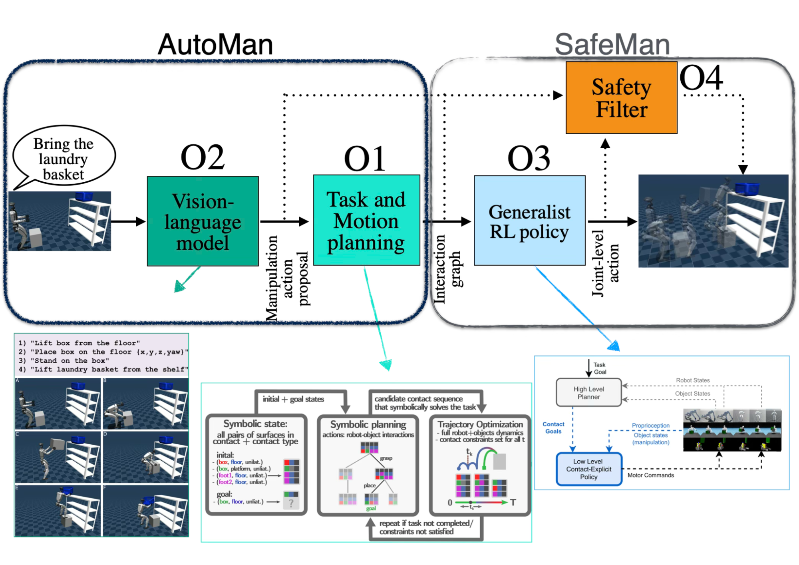
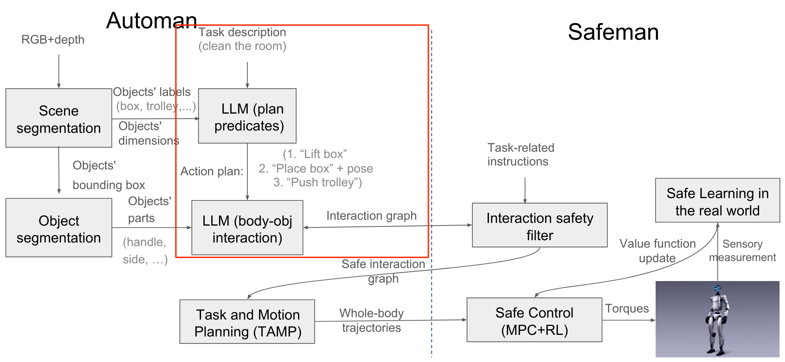

# 🤖 Automan-LLM: Action Planning and Contact Graph Generation for Embodied Robots

Automan-LLM is a modular pipeline that transforms **high-level household instructions** into:

1. **LLM-generated action plans** (symbolic manipulation steps)  
2. **LLM-generated contact graphs** (body–object interaction constraints)  
3. **TAMP-ready semantic grounding** for downstream trajectory generation  

This work represents the **upper half of the AutoMan framework**:  
you handle **task description → symbolic reasoning → interaction modeling**,  
while the **TAMP execution layer** remains outside the scope of this project.

---

## How This Project Fits Into AutoMan

Your contribution corresponds to the **LLM-based reasoning modules** of AutoMan:

- **LLM (plan predicates)** → generates the structured *action plan*  
- **LLM (body–object interaction)** → generates the *contact graph*  
- These outputs are then handed to a **Task and Motion Planner (TAMP)**,  
  which is *not implemented here* but is the mechanism that executes the robot motion.


### What is *outside* the scope

- Vision / scene segmentation  
- Object part extraction  
- Trajectory optimization / whole-body motion generation (TAMP)  
- Safety filtering & RL control (SafeMan)

This repository therefore evaluates the **LLM-driven symbolic reasoning layer** of AutoMan.

---

##  AutoMan + SafeMan Architecture (Context)

To give context, here are the diagrams that show where Automan-LLM fits inside the broader system.

### **High-Level Overview of AutoMan and SafeMan**




---

### Detailed Flow: Where Automan-LLM Operates

---
## Key Features

- Structured action planning using LLMs  
- Contact graph generation for body–object interaction semantics  
- Scenario-based benchmarking (cleaning home, coffee making, box-moving…)  
- Automatic accuracy scoring using goal conditions  
- Supports local (Ollama) and cloud (OpenAI, Gemini, Hugging Face) models  
- Integration with **Autogen** for multi-agent orchestration and tool-calling  
- Support for **Unified Prompting Approaches** to ensure consistent model evaluation  
- Fully Dockerized for reproducibility  
- Installation scripts for macOS, Linux, Windows (Ollama installation + model pulls)

---

##  Main Objective:

Our primary focus is to evaluate **how accurately different LLMs perform** across diverse and increasingly complex robot manipulation scenarios. By testing models under varying scene structures, object configurations, and task complexities, we systematically analyze their reasoning quality, robustness, and physical interaction consistency.

---

# Repository Structure
```bash
automan_llm/
│
├── src/
│   ├── agents/
│   ├── model_clients/
│   ├── benchmarking/
│   ├── outputs/
│   ├── scores/
│   ├── run_model.py
│   ├── Prompts.py
│   └── __init__.py
│
├── scripts/
│   ├── install_ollama_mac.sh
│   ├── install_ollama_linux.sh
│   ├── install_ollama_windows.ps1
│   └── pull_models.sh
│
├── requirements.txt
├── Dockerfile
├── docker-compose.yml
├── .env
├── .gitignore
└── README.md
```
---

# 🚀 Installation
## 0. Prerequisites

Make sure you have: [Docker Desktop](https://www.docker.com)

## 1. Clone the repository

```bash
  git clone https://github.com/yourusername/automan_llm.git
  cd automan_llm
```

## 3. Install  Ollama (for local LLMs)
Use one of the provided installation scripts:
**macOS**
```bash
  bash scripts/install_ollama_mac.sh
```
**Linux**

```bash
  bash scripts/install_ollama_linux.sh
```
**Windows (PowerShell)**
```bash
  .\scripts\install_ollama_windows.ps1
```

## 4. Pull Required Models

```bash
  bash scripts/pull_models.sh
```

This automatically downloads models locally:
- qwen3
- mistral
- gemma3
- ministral-3:8b 
- llama3.1:8b

Additional models can be found in the [Ollama Library](https://ollama.com/library)
To add them, edit `scripts/pull_models.sh` and append them to the models array:
```bash
  models=(
  "mistral"
  "gemma3"
  "qwen3"
  "llama3.1:8b"
  "ministral-3:8b"
  "your-new-model-here"
  )
```

## 5.Environment Variables
Copy the template:
cp .env.example .env

Then edit `.env` and insert your API keys:

GEMINI_API_KEY=...

OPENROUTER_API_KEY=...

OLLAMA_API_KEY=...

HF_TOKEN=...

API keys can be obtained from:

- [Gemini](https://aistudio.google.com/api-keys),  
- [OpenRouter](https://openrouter.ai/settings/keys).
- [Ollama Cloud](https://ollama.com/settings/keys),  
- [Hugging Face](https://huggingface.co/settings/tokens),  
##  6.Build the Docker image
```
docker compose build
```
From the project root:

This:

- Installs all Python dependencies
- Copies your src/ folder into the container
- Sets up the working environment

## 7.Run the Automan-LLM pipeline inside Docker

First, make sure Ollama is running on your system with the command:
```
ollama --version
```
Then run:
```
docker compose run --rm automan-llm python src/ollama_local_model.py
```
This:

1. Starts the automan-llm service  
2. Connects to host Ollama via `OLLAMA_HOST=host.docker.internal`  
3. Runs your local-model benchmark script  
4. Cleans up after exit (`--rm`)

Optional: open a shell inside the container
```
docker compose run --rm automan-llm bash
```
Then manually execute:
```
python src/ollama_local_model.py
```